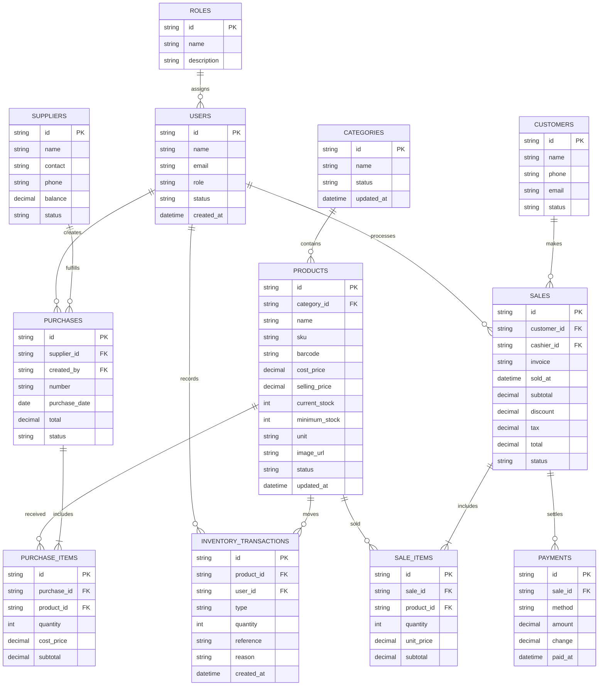

# Lotus Retail OS domain model

```mermaid
erDiagram
    USERS {
        string id PK
        string name
        string email
        string role
        string status
        datetime created_at
    }
    ROLES {
        string id PK
        string name
        string description
    }
    CATEGORIES {
        string id PK
        string name
        string status
        datetime updated_at
    }
    PRODUCTS {
        string id PK
        string category_id FK
        string name
        string sku
        string barcode
        decimal cost_price
        decimal selling_price
        int current_stock
        int minimum_stock
        string unit
        string image_url
        string status
        datetime updated_at
    }
    SUPPLIERS {
        string id PK
        string name
        string contact
        string phone
        decimal balance
        string status
    }
    PURCHASES {
        string id PK
        string supplier_id FK
        string created_by FK
        string number
        date purchase_date
        decimal total
        string status
    }
    PURCHASE_ITEMS {
        string id PK
        string purchase_id FK
        string product_id FK
        int quantity
        decimal cost_price
        decimal subtotal
    }
    CUSTOMERS {
        string id PK
        string name
        string phone
        string email
        string status
    }
    SALES {
        string id PK
        string customer_id FK
        string cashier_id FK
        string invoice
        datetime sold_at
        decimal subtotal
        decimal discount
        decimal tax
        decimal total
        string status
    }
    SALE_ITEMS {
        string id PK
        string sale_id FK
        string product_id FK
        int quantity
        decimal unit_price
        decimal subtotal
    }
    PAYMENTS {
        string id PK
        string sale_id FK
        string method
        decimal amount
        decimal change
        datetime paid_at
    }
    INVENTORY_TRANSACTIONS {
        string id PK
        string product_id FK
        string user_id FK
        string type
        int quantity
        string reference
        string reason
        datetime created_at
    }
    ROLES ||--o{ USERS : assigns
    CATEGORIES ||--o{ PRODUCTS : contains
    SUPPLIERS ||--o{ PURCHASES : fulfills
    USERS ||--o{ PURCHASES : creates
    PURCHASES ||--|{ PURCHASE_ITEMS : includes
    PRODUCTS ||--o{ PURCHASE_ITEMS : received
    CUSTOMERS ||--o{ SALES : makes
    USERS ||--o{ SALES : processes
    SALES ||--|{ SALE_ITEMS : includes
    PRODUCTS ||--o{ SALE_ITEMS : sold
    SALES ||--o{ PAYMENTS : settles
    PRODUCTS ||--o{ INVENTORY_TRANSACTIONS : moves
    USERS ||--o{ INVENTORY_TRANSACTIONS : records
```

The UI currently presents realistic fixture data from `lib/mock-data.ts`; the same entity boundaries are represented in `db/db.json` for the JSON Server adapter.

